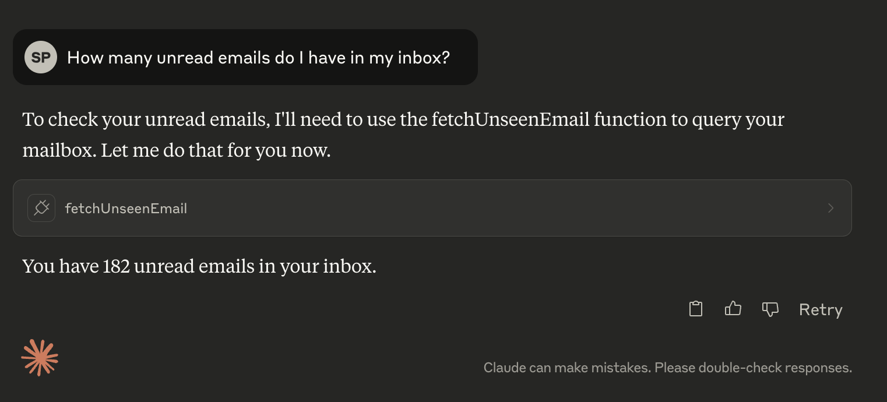

#  API

Currently I am thinking this project will be similar to API.me...
1 difference is that this project will have an MCP API & a REST API. 
The MCP interface will be used for clients like Claude, OpenAI, etc. 
Where as the REST API could be leveraged for other reporting tasks or other automation tasks

## Project 
### Current State:
- MCP Server
    - Can search for unread emails in provided mailbox

- Email Server
    - Can complete basic searches for a provided mailbox 

### Project Next Steps
1. Gather PDF attachments
2. Add OCR capability 
    - Start with Mistral OCR API?
3. Upon completion of 1 & 2, add ability to fetch email with attachment & perform OCR, returning structured output 
---
## REST API
### Email
#### Current State: 
- Can search for unread emails in provided mailbox
- Updated to version of SwiftMail which handles email header & body differently

#### Next:

### OCR
#### Current State: 
- Created new OCR server & client, uses Mistral under the hood
- Created new endpoint for performing OCR on an email, providing correct email search criteria 

#### Next:
- Get MCP server running again, such that we can list email details. Then find the uID, sequenceNumber, section for a valid email to perform OCR on  
    
---
## MCP API
### Current State:  
- Can search for unread emails in provided mailbox

### Next:
- Explore how we could use Templated Resources 
    - Could leverage Email API? 

